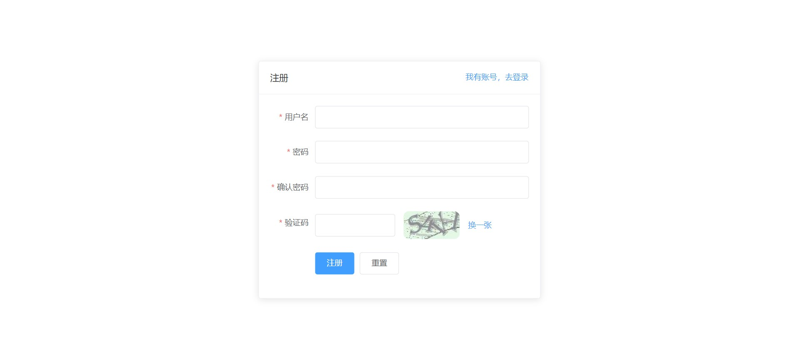
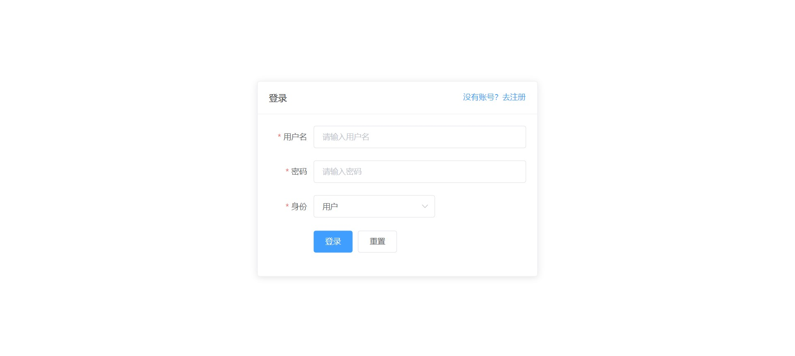
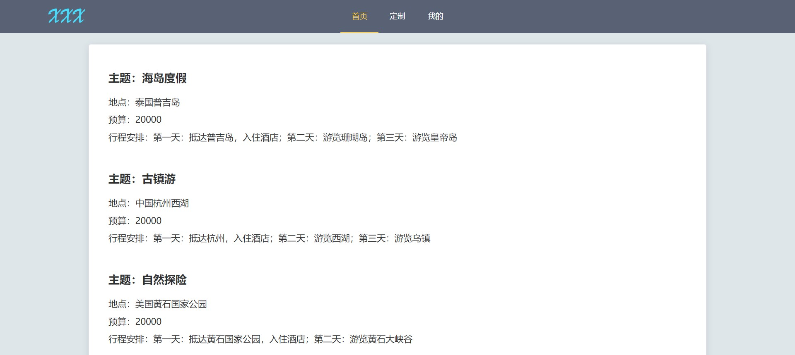
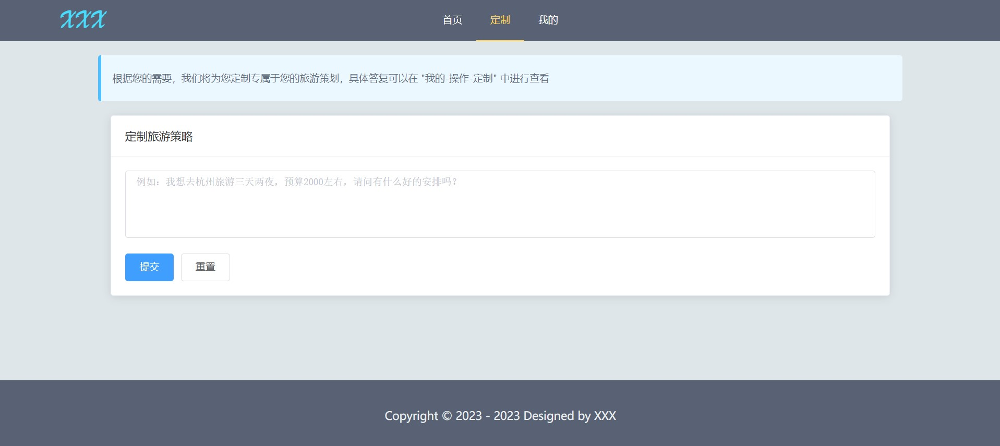
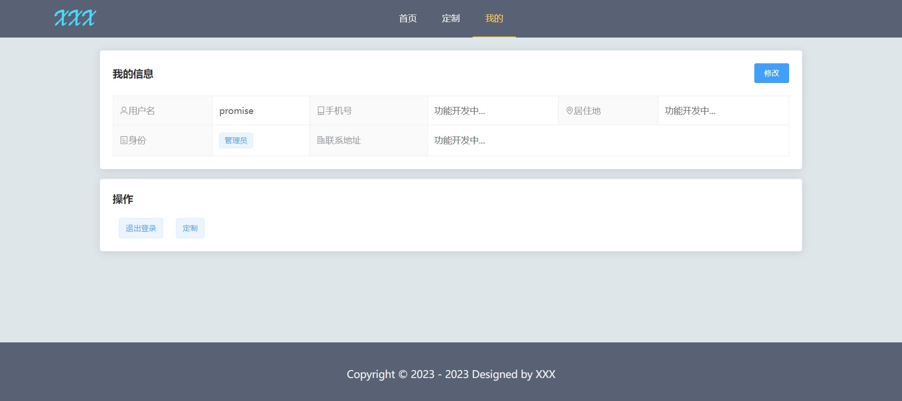
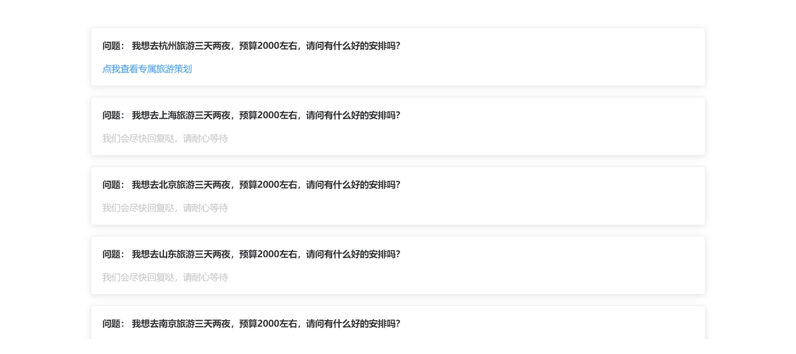
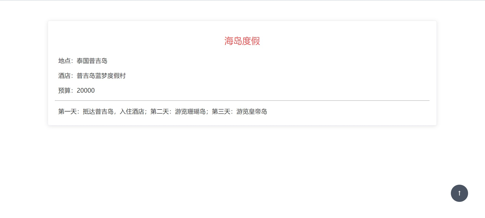
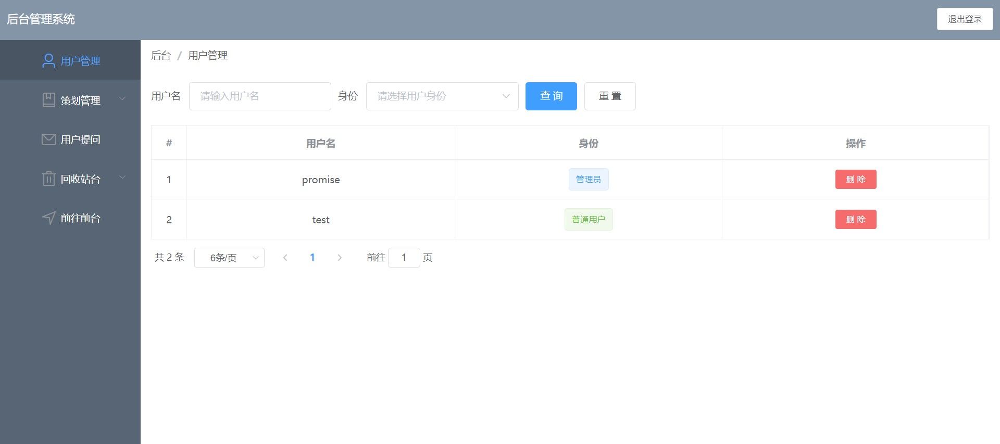

# quick-start-template
快速构建一个简单的前后端分离项目，拒绝重复劳动，包含简单的Vue+Element代码和SpringBoot+MybatisPlus的基本CRUD代码，包含登录、注册、前后台页面数据展示以及增删改查。


## 项目技术栈

前端：HTML+CSS+Vue+VueRouter+Vuex+axios+Element

后端：SpringBoot+Spring+MybatisPlus+MySQL


## 如何使用

1. 拉取代码

   ```cobol
   git clone git@github.com:zhangb-top/quick-start-template.git
   ```

2. IDEA加载Java包里面的项目，加载对应的maven所需的依赖，修改application.yml文件，设置自己的数据库用户名和密码。在自己的数据库中创建名为internet_competition的数据库，同时执行sql.sql文件，创建表格，后期可以根据自己的业务需求改变数据库名称和表格，但是不要忘记同步修改Java代码。做好后启动SpringBoot工程即可

3. VSCode加载Vue包下的项目，使用`npm install`命令下载所需的依赖包。下载完成后，使用`npm run serve`命令启动项目即可，访问`localhost:8080`地址即可


## 项目实现功能

### 注册功能

前端对密码进行了简单的SHA256加密传输给后端，简单的保证了密码的安全。后端有验证码效果，防止机器注册



### 登录功能

前端通过本地存储保存后端传输的token，每次请求添加请求头，把token传入



### 首页

使用Element的Card组件简单展示基本数据，页面没有进行美化



### 定制

允许用户传输数据给后端，后端通过后台来回复（这里没有实现）



### 我的

用户资料展示，以及一些基本操作



### 定制

这里属于业务模块，工具需要进行取舍



### 详情

基本的点击展示详情数据的功能



### 后台

这里只是实现了后台框架的基本搭建，以及简单的表格功能


